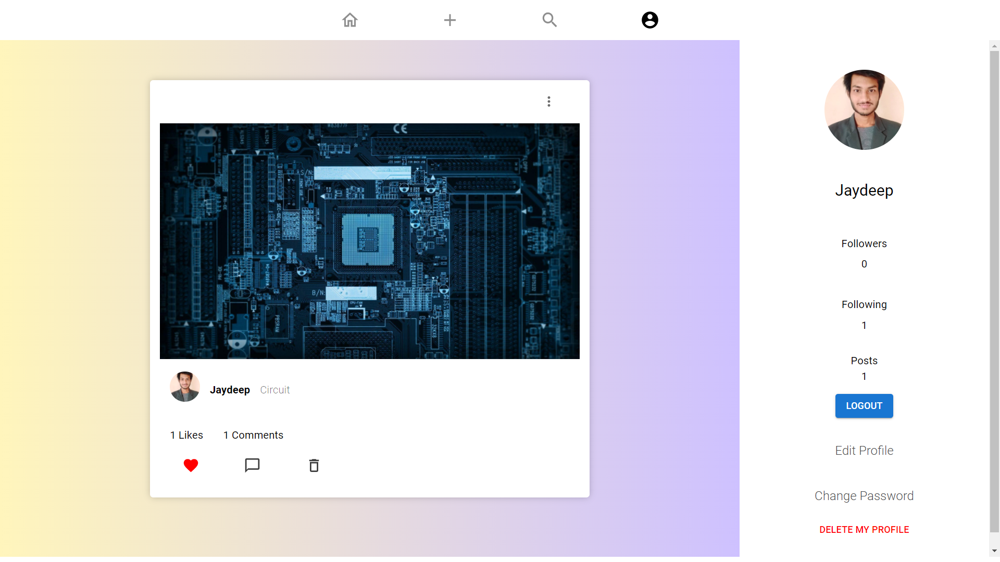

# Mern-Social-Media-App

[Live Link]()

## Install Dependencies

**For Backend** - `npm i`

**For Frontend** - `cd frontend` `&&` `npm i`

## Features:

- Mongoose schemas to model the application data
- Express middleware is used to handle requests, routes
- React for displaying UI components
- Redux to manage application's state
- Node provides the backend environment for this application

## Env Variables

Make Sure to Create a config.env file in backend/config directory and add appropriate variables in order to use the app.

**Essential Variables** 

PORT = \
MONGO_URI = \
JWT_SECRET = \
SMTP_SERVICE = \
SMTP_PORT = \
SMTP_MAIL = \
SMTP_PASSWORD = \
SMTP_HOST = \
CLOUDINARY_NAME = \
CLOUDINARY_API_KEY = \
CLOUDINARY_API_SECRET = 
